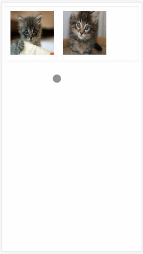

# react preview plugin

> 一个React集成[PhotoSwipe](https://github.com/dimsemenov/PhotoSwipe)的**移动端**与**PC端**图片预览插件


## Demo



## Requirements

[PhotoSwipe](https://github.com/dimsemenov/PhotoSwipe)

## Installation

``` bash
npm i react-img-preview -S
```

## Usage
### Import plugin
```javascript
import Preview from 'react-img-preview'
```

### Examples
```jsx
import React from 'react'
import ReactDOM from 'react-dom'
// 导入缩略图组件
import Preview from 'react-img-preview'

// 专门用于测试的组件
class Test extends React.Component {
  constructor() {
    super()
    this.state = {
      // 所有要进行预览的图片
      // 每一个图片对象，都要包含如下三个属性：{src, w, h}
      // 其中：
      // src 是图片的地址
      // w 是图片预览时候的宽度
      // h 是图片预览时候的高度
      items: [
        {
          src: 'https://placekitten.com/600/400',
          w: 600,
          h: 400
        },
        {
          src: 'https://placekitten.com/1200/900',
          w: 1200,
          h: 900
        }
      ]
    }
  }

  render() {
    return <div>
      <Preview
        // 【必填】指定 要预览的图片数组
        imglist={this.state.items}
        // 【previewBoxStyle 可选】设置 缩略图容器的样式
        previewBoxStyle={{ border: '1px solid #eee' }}
        // 【thumbImgStyle 可选】设置 缩略图的样式
        thumbImgStyle={{ margin: 10, width: 100, height: 100 }}>
      </Preview>
    </div>
  }
}

// 把 虚拟DOM挂载到页面上
ReactDOM.render(<div>
  <Test></Test>
</div>, document.getElementById('app'))
```


## API

| 属性            | 类型               | 作用                                                         |
| --------------- | ------------------ | ------------------------------------------------------------ |
| imglist         | Array数组、必填项  | 指定需要进行预览时候的图片数组；<br />数组中每个图片信息，都应该是包含如下三个属性的对象<br />例如： {src: '图片地址', w: 宽度值, h: 高度值} |
| previewBoxStyle | Object对象、可选项 | 设置缩略图外层容器div的style样式                             |
| thumbImgStyle   | Object对象、可选项 | 设置每个缩略图的style样式，默认每张图片宽高各为 100px、且有 10px 的 margin |


## Quick Start

可以直接`clone`源代码，`npm install`安装依赖包，运行 `npm run dev` 快速查看项目效果！
1. `git clone git@github.com:daidaitu1314/react-img-preview.git`
2. cd 到项目根目录运行 `npm install`
3. `npm run dev` 快速启动

## License


